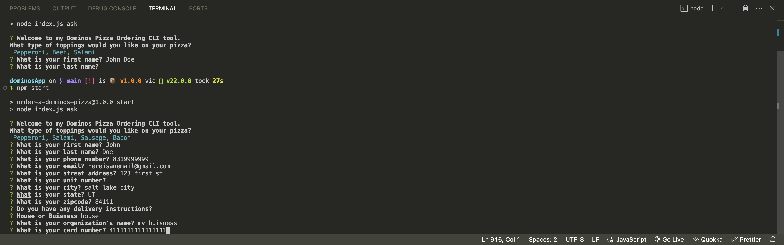
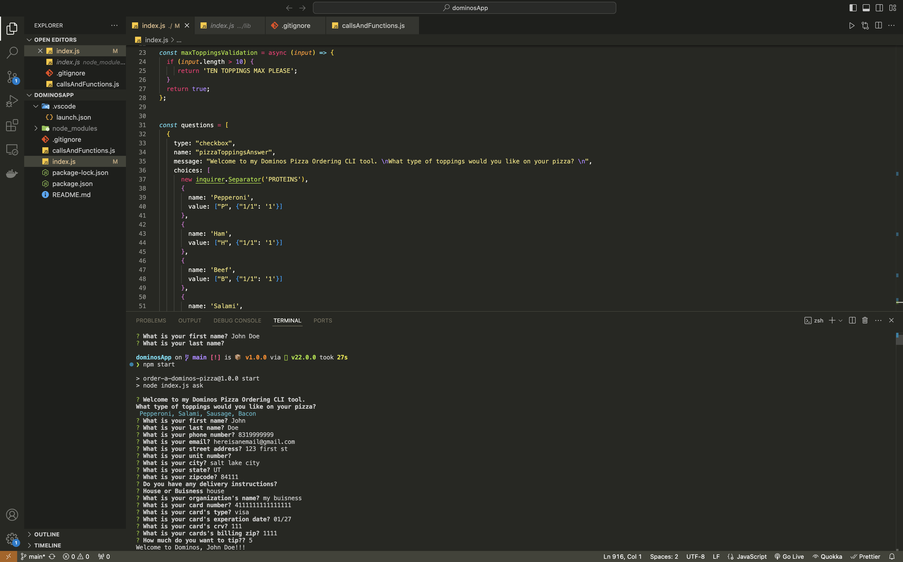
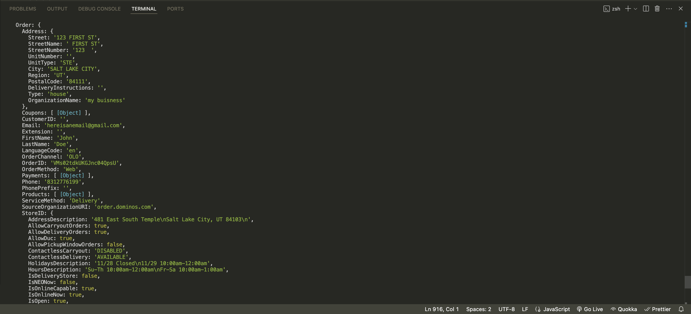
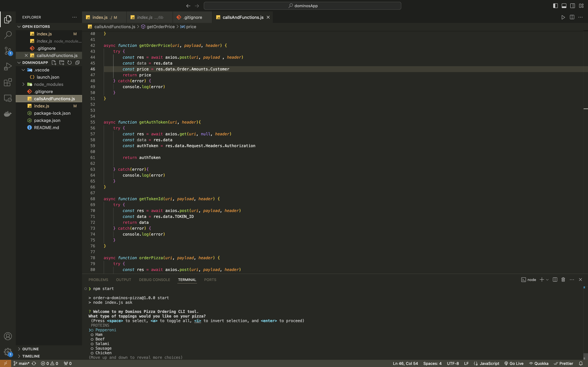

🍕 DomiNode Pizza CLI Tool

A Node.js-based CLI tool to have a pizza delivered right to your home (or wherever you are).

Craving pizza but don’t want the hassle of using the Domino’s app or website? Look no further! DomiNode lets you order a pizza directly from your command line. Built with Node.js, Commander, and Inquirer, this interactive tool makes it easy to get exactly what you want, whenever you want — delivered to your door.

🚀 Features

Order a pizza directly from your CLI without needing the Domino’s app or website.

Uses deconstructed Domino’s REST APIs to place an order.

Interactive prompts powered by Commander and Inquirer to customize your order.

Seamless checkout experience with minimal hassle.

📦 Installation

Clone this repository and install dependencies:

git clone https://github.com/<your-username>/dominode.git
cd dominode
npm install

▶️ Usage

Start the CLI tool with:

 "npm start"

## 🖥️ Demo (Screenshots)

Here are some real screenshots from the app in action:  

### Selecting toppings in the CLI

---

### Full order entry flow

---

### Final confirmation output

---

### Functions behind the scenes

🛠️ Tech Stack

Node.js

Commander

Inquirer

Domino’s REST API

📖 Notes

This project is for educational/demo purposes only. It is not affiliated with or endorsed by Domino’s Pizza.